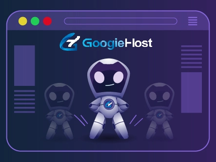
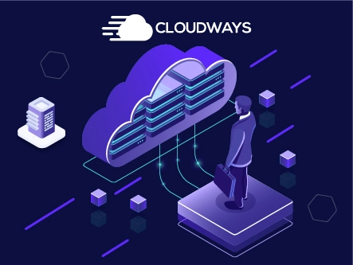
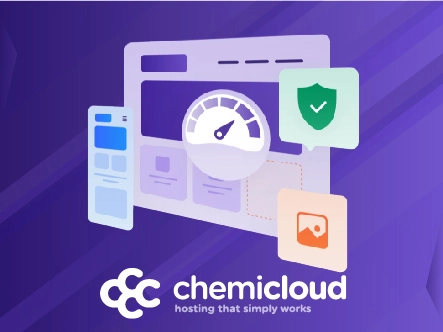

# Best Free Laravel Hosting Providers in 2025: Speed Meets Simplicity

Looking to deploy your Laravel project without breaking the bank? You're facing a common developer dilemma: Laravel's dynamic architecture needs hosting that can keep up with its performance demands, but quality hosting often comes with a hefty price tag.

Here's the thing—choosing generic shared hosting for your Laravel site is like putting regular gas in a sports car. Sure, it'll run, but you won't get anywhere near the performance you need. Laravel applications thrive on optimized environments with proper PHP configurations, queue management, and robust infrastructure.

This guide walks you through 9 solid hosting providers offering free trials or genuinely free tiers for Laravel projects. We've tested their speed, reliability, and developer-friendly features so you can focus on building rather than troubleshooting server issues.

---

## What Makes Laravel Different?

Before we jump into the hosting options, let's get clear on what Laravel actually needs. Laravel is a PHP framework that makes building dynamic web applications significantly easier through its pre-built modules and elegant syntax. Despite new frameworks launching constantly, Laravel remains a developer favorite for good reason.

The catch? Laravel applications are resource-intensive compared to static sites. They need:
- Modern PHP versions with proper extensions
- Database optimization (MySQL/PostgreSQL)
- Queue worker support for background jobs
- Composer dependency management
- Adequate memory allocation

This is why Laravel-optimized hosting matters. Standard hosting plans often lack these configurations, leading to slow load times and frustrating deployment issues.

## Top 9 Laravel Hosting Providers Worth Your Time

### 1. Kamatera – Enterprise-Grade Infrastructure

If you're running a serious business or high-traffic application, Kamatera brings enterprise-level features without the enterprise headache.

What sets Kamatera apart is its cloud infrastructure flexibility. You get:

**Cloud Firewall Protection** – Blocks malicious traffic before it reaches your application, essential for Laravel apps handling user data or payments.

**Load Balancing Module** – Distributes traffic across multiple resources, preventing server overload during traffic spikes. This is crucial for Laravel applications with heavy database queries.

**Instant Server Deployment** – Your environment spins up in minutes, not hours. No waiting around for server provisioning.

**ERP Support** – For businesses scaling Laravel applications with complex organizational needs, Kamatera handles enterprise resource planning integration smoothly.

The infrastructure runs on industry-standard hardware across global data centers, giving you low-latency access wherever your users are located.

**Why it works**: Kamatera's 30-day free trial lets you test enterprise features risk-free. If you're beyond the MVP stage and need reliable infrastructure that scales, this is where you want to be.

For Laravel developers tired of shared hosting limitations, 👉 [discover how Kamatera's cloud infrastructure handles Laravel's demanding workloads effortlessly](https://www.vultr.com/?ref=9738262-9J) with flexible resource allocation and instant scaling capabilities.

---

### 2. GoogieHost – Actually Free Forever

Most "free" hosting comes with asterisks. GoogieHost doesn't.

You get legitimate free hosting for life—not a trial that converts to paid after 30 days. For developers learning Laravel or testing projects before launch, this matters.

**Full PHP Support** – All PHP versions work seamlessly, so you're not stuck on outdated configurations.

**Unlimited MySQL Databases** – Use your allocated database resources without artificial restrictions or interruptions.

**LiteSpeed Web Server** – One of the fastest web servers available, and you get it at zero cost. LiteSpeed significantly improves Laravel's response times compared to Apache.

**Instant Setup** – Enter your details, select your plan, and your server is ready immediately after signup.

The free tier won't support a production application with serious traffic, but for development environments, portfolio sites, or learning projects, GoogieHost delivers surprising value.

**Why it works**: Zero ongoing costs mean you can experiment with Laravel without financial pressure. When you're ready to scale, their premium plans offer seamless upgrades.

---

### 3. DigitalOcean – Developer-Friendly Cloud Platform

Founded in 2011, DigitalOcean carved out a reputation among developers for straightforward cloud hosting that doesn't require a PhD to configure.

**Reliable Infrastructure** – DigitalOcean uses enterprise-grade hardware optimized for consistent performance rather than maximum specs.

**Intuitive Dashboard** – While powerful, the control panel stays simple. You can monitor server performance, manage resources, and deploy applications without getting lost in complexity.

**API Integrations** – Automate deployments, manage resources programmatically, and integrate with CI/CD pipelines through well-documented APIs.

**Managed Database Hosting** – Run your Laravel database on dedicated infrastructure separate from your application server. This architectural separation improves both performance and security.

DigitalOcean's droplets (virtual machines) start at $4/month, but new users get $200 in credit valid for 60 days—essentially free hosting for two months.

**Why it works**: The combination of developer-friendly tools and solid infrastructure makes DigitalOcean ideal for tech-savvy users who want control without unnecessary complexity.

---

### 4. Cloudways – Fully Managed Without the Hassle

Not a technical person? Cloudways handles the server management so you can focus on development.

Cloudways doesn't own servers—they manage cloud infrastructure from providers like DigitalOcean, AWS, and Google Cloud. You get enterprise infrastructure with zero configuration headaches.

**Cloudflare Integration** – Built-in CDN support accelerates content delivery globally, crucial for Laravel applications serving international audiences.

**Simplified DNS Management** – Configure domains quickly without wrestling with cryptic DNS records.

**Enhanced Security** – Protection against malware and online threats runs automatically, keeping your Laravel application secure without manual intervention.

**Auto-Healing Technology** – The system monitors for issues and fixes common problems automatically, minimizing downtime.

Pricing runs slightly higher than unmanaged options (starting around $11/month for DigitalOcean infrastructure), but you're paying for peace of mind and saved time.

**Why it works**: Three-day free trial lets you test the managed experience. If server administration isn't your thing, Cloudways removes that burden entirely.

---

### 5. Vultr – Speed-Focused Cloud Computing

Established in 2014, Vultr built its reputation on high-performance infrastructure at competitive prices.

**Advanced Network Infrastructure** – Deploy on one of the most robust hosting infrastructures available, ensuring optimal performance across regions.

**Native DDoS Mitigation** – Full protection against distributed denial-of-service attacks safeguards your server resources from malicious traffic.

**Pure SSD Storage** – Latest-generation SSDs provide significantly faster read/write speeds compared to traditional storage, directly improving Laravel's database query performance.

**Multi-Factor Authentication** – Protect your server from unauthorized access with robust authentication security.

New users receive $10 credit to explore Vultr's services without upfront payment.

**Why it works**: If speed is your primary concern—maybe you're running a Laravel application with heavy real-time features—Vultr's infrastructure delivers consistent performance.

When evaluating cloud hosting options for resource-intensive Laravel applications, many developers find that 👉 [robust cloud infrastructure with global data centers and advanced networking capabilities](https://www.vultr.com/?ref=9738262-9J) provides the performance consistency needed for production environments.

---

### 6. InterServer – Budget-Friendly Reliability

Operating since 1999, InterServer has served everyone from startups to Fortune 500 companies with consistent quality.

**Ultra-Fast Speed** – Latest SSD hardware ensures your Laravel application runs smoothly without storage bottlenecks.

**Self-Healing Hardware** – Intelligent monitoring systems detect and automatically fix server issues before they impact your site.

**Top-Tier Security** – Remote backups, full DDoS protection, and malware scanning keep your application secure.

**Powerful Virtualization** – KVM and Hyper-V virtualization mean your workload stays isolated from other VPS instances on the same node—you get your full resource allocation.

Plans start around $6/month, with occasional promotions offering significant first-term discounts.

**Why it works**: InterServer balances affordability with enterprise features, making it suitable for growing businesses that need reliability without massive budgets.

---

### 7. HostArmada – Comprehensive Modern Hosting

Founded in 2019, HostArmada quickly gained traction by offering diverse hosting solutions with strong performance.

**Full DNS Management** – Offload DNS complexities to HostArmada's team while you focus on business growth.

**Cloudflare Support** – Seamless CDN integration accelerates page loads and improves overall performance without configuration headaches.

**Hotlink Protection** – Prevents other sites from stealing your bandwidth by embedding your images or media files.

**Web Application Firewall** – Guards against cyber attacks including malware injection and DDoS attempts.

HostArmada offers cloud hosting, reseller hosting, and specialized Laravel-optimized plans, giving you flexibility as your needs evolve.

**Why it works**: The combination of modern features and straightforward management makes HostArmada reliable for Laravel projects of varying complexity.

---

### 8. YouStable – Affordable Without Compromise

YouStable targets developers who need quality hosting at genuinely affordable prices without sacrificing essential features.

**Top-Tier Security** – BitNinja firewall provides comprehensive protection against DDoS, malware, and malicious attacks.

**Latest Hardware** – NVMe SSD storage delivers faster and more secure capacity compared to standard SSDs.

**Quick Setup** – Your site goes live within 60 seconds of completing payment, thanks to dedicated deployment teams.

**99.99% Uptime Guarantee** – Minimal downtime means your Laravel application stays accessible when users need it.

Plans start remarkably low while including features typically reserved for higher-tier hosting.

**Why it works**: For developers launching their first Laravel project or bootstrapped startups watching every dollar, YouStable delivers impressive value without cutting corners on essentials.

---

### 9. ChemiCloud – Lightning Performance Focus

Founded in 2016, ChemiCloud has hosted over 80,000 websites with a focus on speed and reliability.

**Advanced Firewalls** – Protect your Laravel site from cyber attacks including DDoS with comprehensive malware protection.

**Two-Factor Authentication** – Secure your site against unauthorized access with robust authentication systems.

**Full DDoS Protection** – Dedicated anti-DDoS features beyond standard firewall protection.

**One-Click App Installer** – Easy-to-use control panel lets you install applications with single clicks.

ChemiCloud's standout feature is unmetered resources—use your allocated bandwidth without artificial caps or throttling.

**Why it works**: If you need unlimited resource usage within your plan tier, ChemiCloud removes the anxiety of hitting bandwidth limits during traffic surges.

---

## Why Laravel-Specific Hosting Matters

You might wonder if specialized Laravel hosting is just marketing hype. It's not.

Laravel applications require specific server configurations that generic hosting often lacks:

- **Queue Workers**: Laravel's queue system handles background jobs efficiently, but requires proper daemon configuration
- **Composer**: Dependency management needs sufficient memory allocation during deployment
- **Artisan Commands**: Laravel's CLI tools need proper PHP execution permissions
- **Cache Drivers**: Optimal performance requires Redis or Memcached support
- **PHP Extensions**: Laravel needs specific PHP extensions (OpenSSL, PDO, Mbstring, etc.)

Generic shared hosting rarely includes these optimizations out of the box. Laravel-focused hosting removes configuration headaches and ensures your application runs as intended.

## Making Your Choice

**Starting a side project or learning Laravel?** GoogieHost's lifetime free hosting gives you a risk-free playground.

**Building an MVP or small business application?** YouStable or InterServer balance affordability with solid features.

**Running a production application with real users?** Kamatera, DigitalOcean, or Vultr provide the infrastructure reliability you need.

**Hate server management?** Cloudways handles the technical details while you focus on code.

The best hosting isn't necessarily the most expensive or feature-packed—it's the one that matches your current needs and scales as you grow.

---

## Conclusion

Laravel hosting doesn't have to drain your budget or force you into complex server administration. Whether you're testing ideas, building an MVP, or scaling a production application, quality hosting options exist at every price point.

For beginners and side projects, genuinely free options like GoogieHost remove financial barriers to getting started. When you're ready to scale, providers like Kamatera offer enterprise-grade infrastructure with the performance and reliability serious applications demand.

The key is matching your hosting to your current stage. Start with what makes sense now, knowing you can upgrade as your Laravel application grows. Performance, security, and developer experience shouldn't be mutually exclusive—with the right hosting choice, you get all three.
